# Henryka The Speaker

Welcome to the project of an open 3D-printable portable Bluetooth speaker. Hope you will have fun building your own. 
Soon your favourite Bluetooth speaker.

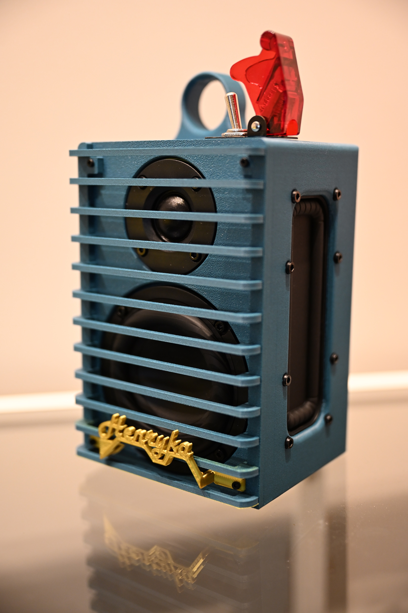

## Tools List

* Hex screwdriver: 1.5 mm, 2.5 mm
* Soldering iron
* Cable cutter
* Glue
* Hot glue gun
* Zip ties
* Self-adhesive thin foam (can be double-sided spongy tape as well)

## Parts List

**Amplifier with Bluetooth:**

* Mini Ultra HD I2S TAS5805 Bluetooth DSP Amplifier Board 2.0/1.1 Channel 60 W
* For this amplifier you need a cooling radiator 2 × 2 × 1 cm

**BMS:**

* 5S Li-ion Lithium Battery 18650 Charger BMS

**Charging:**

* PD3.1 IP2369 45 W PD Fast Charging 2S-6S Li-ion/LiFePO4 Lithium Battery Charger/Discharger

**Power:**

* 5× 18650 Li-Ion batteries
* 18650 spring-loaded connectors [11.28 × 11.5 mm]
* Missile-style switch KN3A-101 toggle switch, rocker arm, 2-pin, 2-gear ON-OFF, 10 A 125 V/250 V AC, cap matching 12 V, 24 V, 48 V, 110 V, 220 V universal

**Subwoofer speaker:**

* AIYIMA Audio 3-inch portable subwoofer speaker, 60 W power, 4 Ohm

**Tweeter speaker:**

* 52 mm round audio speaker, 4 Ohm, 10 W tweeter, silk membrane

**Passive radiator speaker:**

* 120 mm × 49 mm rectangular subwoofer diaphragm guide with frame

**Screws:**

* 11 × M2×8
* 40 × M3×6

**Brass inserts:**

* 11 × M2 – outer diameter 4 mm
* 40 × M3 – outer diameter 5 mm

**Cables:**

* 2 m × 0.5 mm OFC
* 2 m × 0.2 mm OFC single core

## Printing Guide

I printed these components out of PETG-CF: 3 walls, 30 % gyroid infill, layer height 0.2 mm.

**Main shell:**

* Printed laying on the speaker (front) side, with strong supports

**Back:**

* Printed on the back side, no supports

**Front:**

* Print two holder sides flat
* Each of the 12 ribs printed flat on the bed

**Finger loop (aka holder):**

* No supports, printed vertically with variable layer height set to quality

**Logo:**

* Printed with supports, from the back, so that front-facing surfaces have a nice finish

**18650 holder:**

* Printed upside down, with supports, screw and screw holes 😊

## TPU Prints

In the STL directory you will find gaskets and a stand as well; those were printed out of TPU 98A.
Even though I included all designed gaskets, you can get away with printing only the stand.
From tests I’ve observed that the enclosure holds up pressure without any gasket.

That said, I still do recommend printing at least the back-side gasket.

## Assembly Guide

**Disclaimer:** I am not responsible for any fire hazard that may occur due to wrong handling of Li-ion batteries.

Start with the soldering iron and placing **M2** brass inserts in holes as shown in the pictures.

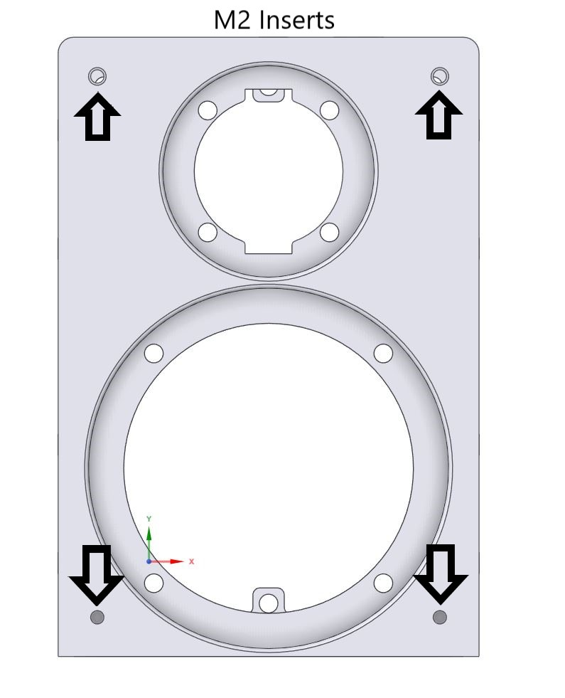
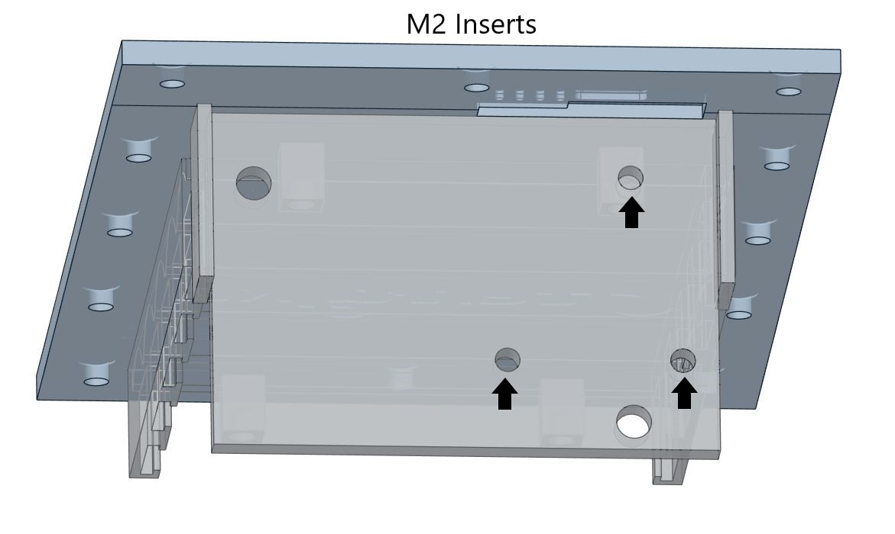
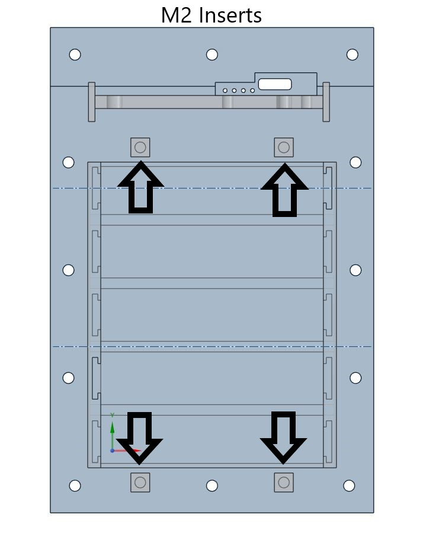

**Be careful: passive radiators do not require any inserts; the frame has threads.**

Continue with **M3** brass inserts in holes as shown in the pictures.

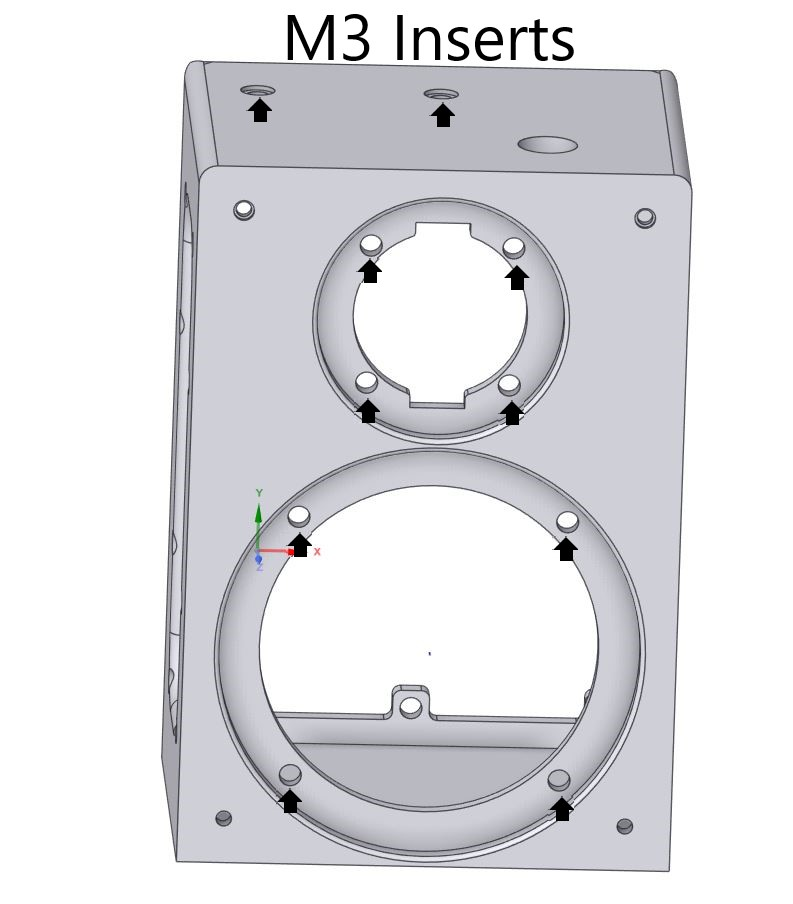
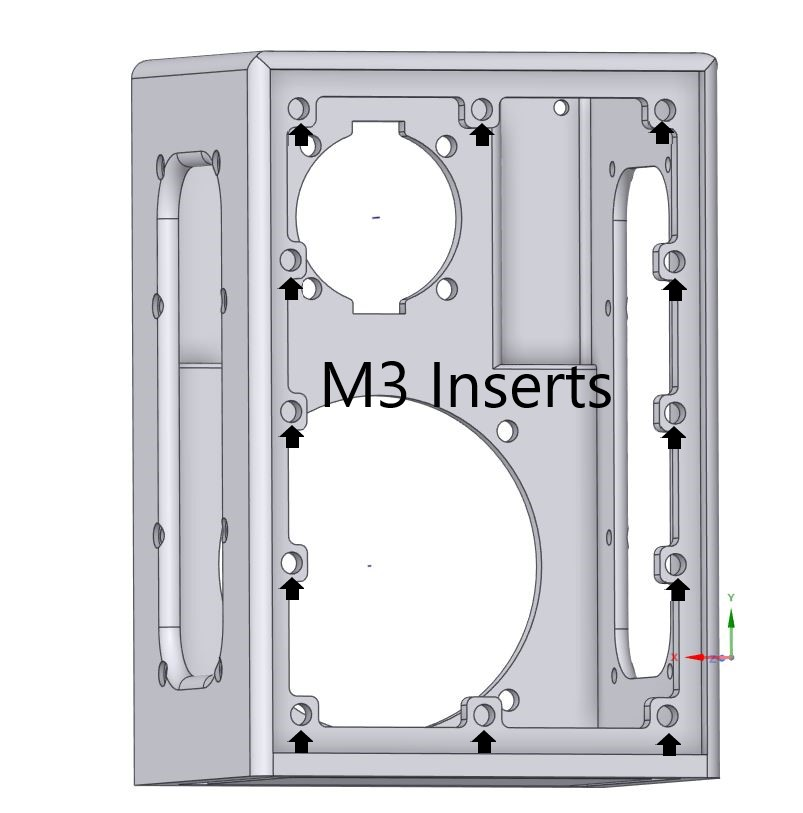
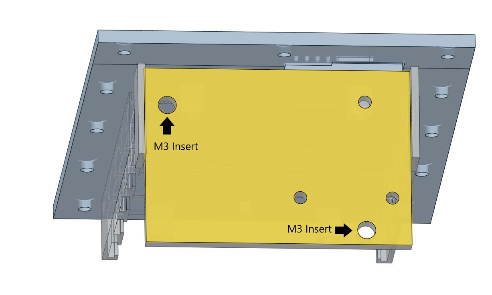

**Mount passive radiators after brass inserts.**

Assuming that you already put the inserts in, you can now test-fit electric components.
USB-C board is mounted via 3 x M2 screw on top of mounting board.
BMS board is mounted via 2 x M3 screws at bottom of board.
Amplifier is designed to be mounted on top of board using double-sided tape and zip-ties as it does not have any mounting holes. As long as it holds up in place, you're ok.
I would suggest mounting it last, and ziptiing to whole mounting board.
I might redesign mounts for it in future as I do not like it.

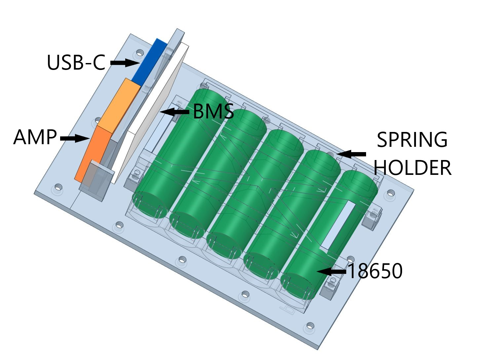

Then continue with soldering cables as shown in the diagram. 
**Depending on your BMS model, negative power output can be P- or C-. RTFM**

## You MUST NOT play anything untill dsp is set or you will DAMAGE tweeter! ##

You can plug two subwoofers at begging to prevent damage.

**Watch out for speaker polarity!**

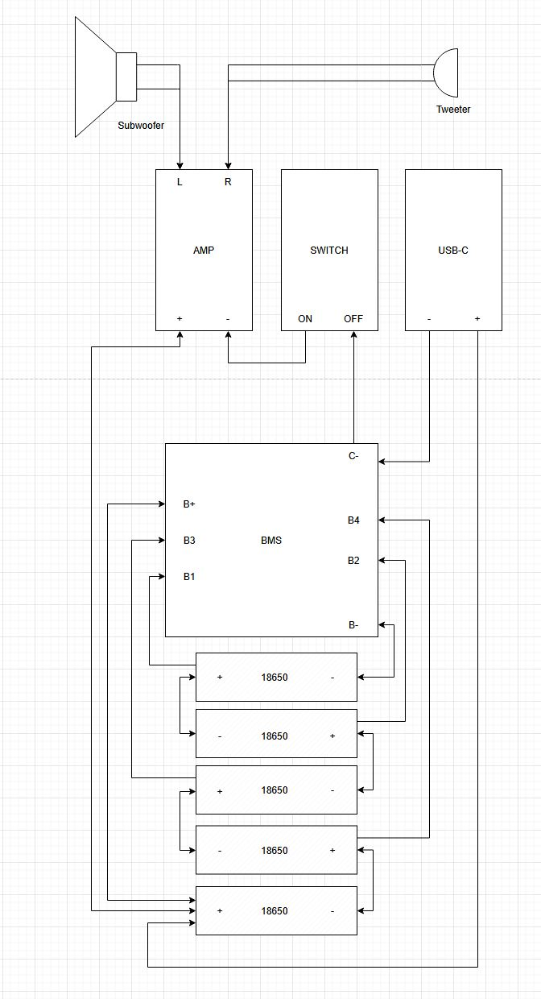

## DSP Tuning

For DSP tuning you need proprietary software called ACPWorkbench, ask the seller of the amplifier for it.

**I would advise you to run it in a virtual machine environment.**

First of all, your amplifier needs power input to be detected by PC, you need to power it on, wait until it starts blinking fast, then connect to pc.
If your computer detected it, it should be called mvsillicon-something under sound cards.

First, you need to set correct output mode of DAC0, to 1.1 or mono depending on ACP version.

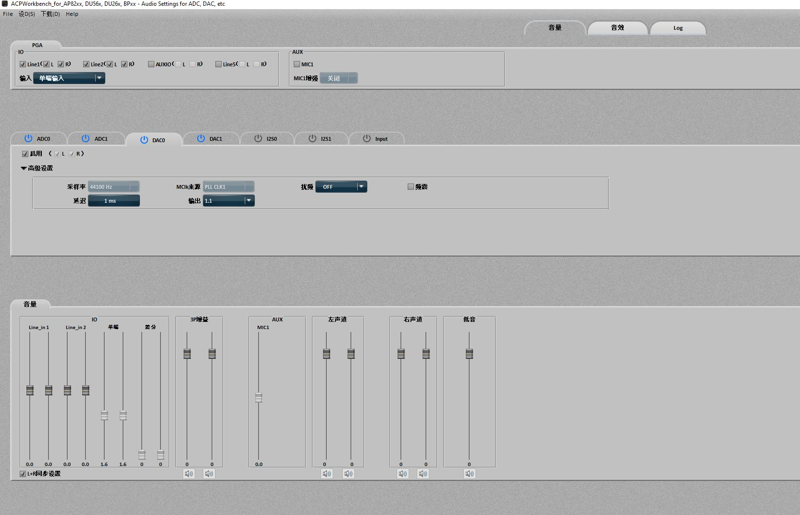

Further, you need to adjust Bluetooth gain to +2dB:

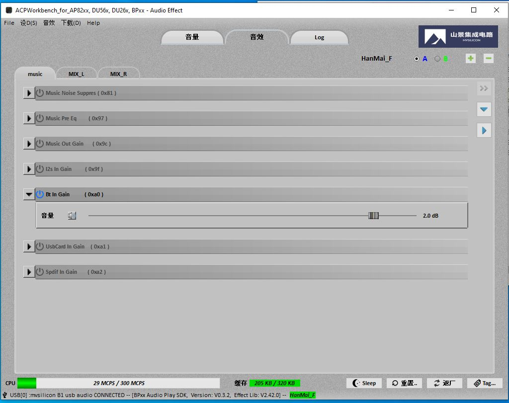

Left channel is set for subwoofer, I did cut frequencies below 48Hz with high pass filter, as the speaker is not efficient or able to create powerfull wave lower than this 48Hz. 

Following two PEAQ filter at 60Hz (+12) and 90Hz(+5) to produce more bass, and the end low pass filter at 2kHz.

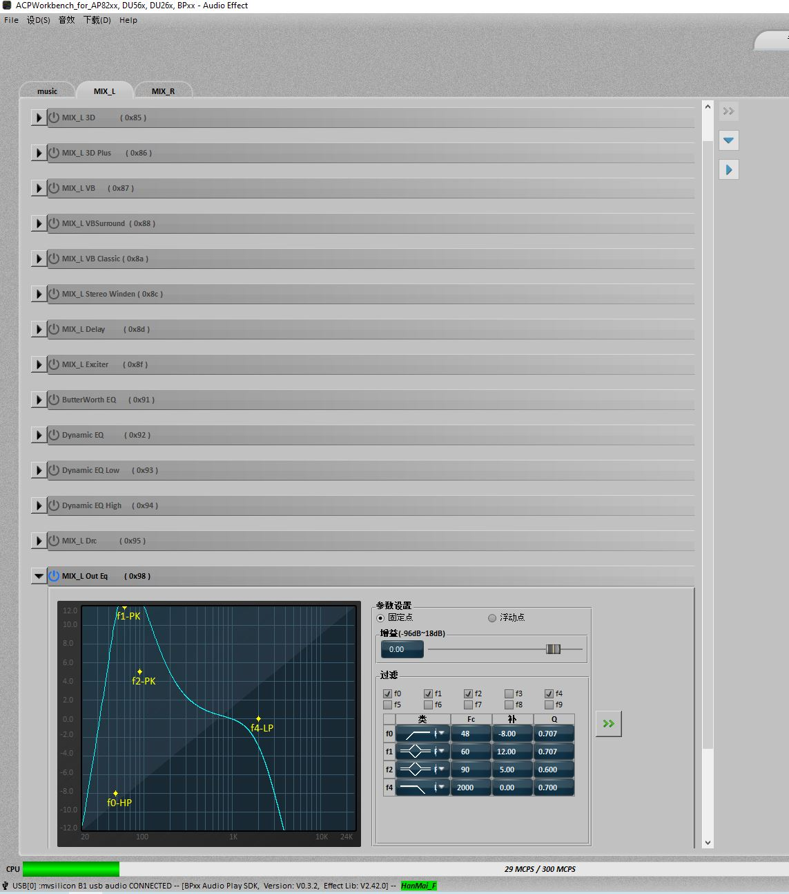

Right Channel is set for tweeter with simple high pass filter at 2.2kHz, and a slight bump at 16kHz. Frequencies don't overlap on purpose, as there is no hard cut-off.

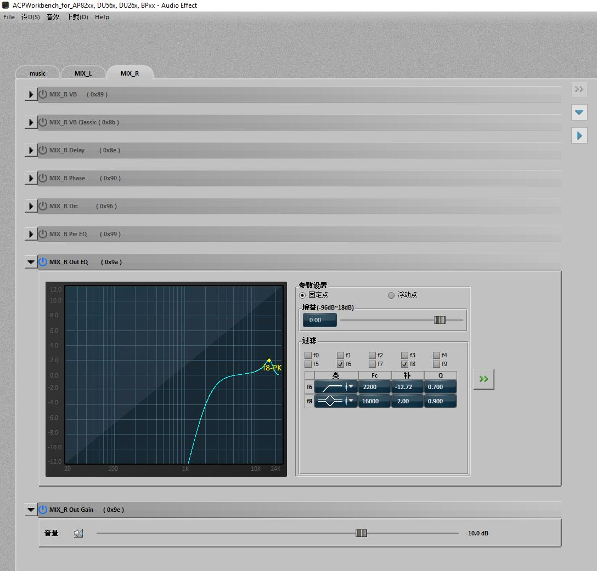

Assuming you have entered all config data you need to save it to flash:

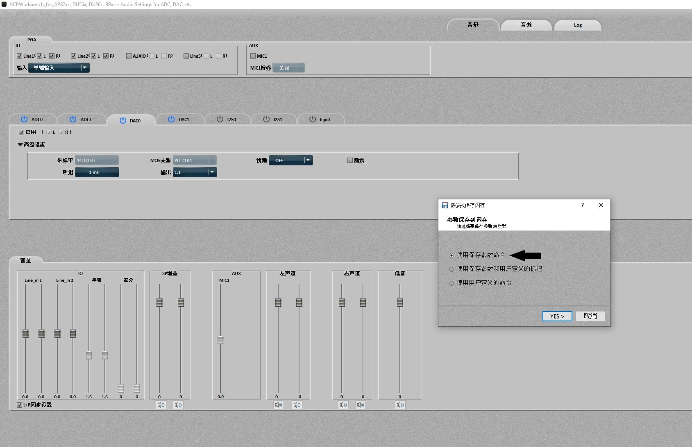

## **After flashing amplifier will reboot, you need to enter again all configuration data and write it, three (3) times!**
This amp has 3 slots of memory, so you need to make sure that no matter which config will be run, you will have proper crossover set.
I strongly advise you to connect first two subwoofer's to prevent tweeter damage.

After 3 flashes of amplifier, you need to:
* Unplug amplifier from PC;
* Power it off;
* Connect ribbon cable with buttons;
* Power on;
* Hold stop button to change input source to bluetooth (hold it untill onboard led flashes quickly)
* Pair with your device;
* Power off;
* Finish assembly;
* Enjoy ;)

## Links

**If links are not valid, pictures of needed stuff are in images/parts**

https://aliexpress.com/item/1005008713984644.html

https://aliexpress.com/item/1005007055662250.html

https://aliexpress.com/item/1005006427814285.html

https://aliexpress.com/item/1005006832828386.html

https://aliexpress.com/item/1005007917972560.html

https://aliexpress.com/item/1005008963450428.html

https://aliexpress.com/item/1005008314123679.html

https://aliexpress.com/item/1005003582355741.html

https://aliexpress.com/item/1005007854404265.html

https://aliexpress.com/item/1005009111898944.html
